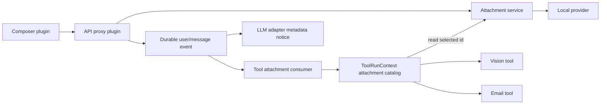

# Session Tool Attachments Plugin Design

## Status

Approved direction: expose attachment metadata from the complete current session to every tool, load bytes only when a tool requests one attachment, preserve existing image behavior, and implement the behavior through plugins rather than the agent loop.

## Problem

The current attachment service, prompt protocol, browser composer, and durable content model support images only. Image-aware tools work around this by scanning the latest human message and calling `AttachmentStore.readImage()`. Other tools receive neither an attachment catalog nor a supported way to read attachment bytes. Generic files such as documents and archives cannot enter the durable conversation at all, and the email tool cannot pass real attachments to Nodemailer.

The result is inconsistent tool behavior. A vision tool can discover the newest image through private logic, while an email tool must ask the model to copy a storage object or encode bytes into text. That workaround is not a capability, does not cover historical attachments, and bypasses session-scoped authorization.

## Goals

- Accept images and arbitrary bounded binary files in conversation input, including documents and archives.
- Record every model-visible attachment reference in the session log.
- Give every tool in an attachment-enabled composition a chronological metadata catalog covering the complete current session.
- Read bytes lazily and only after a tool selects an attachment.
- Authorize reads by current-session references instead of possession of a content-addressed identifier.
- Keep existing image validation, image display, vision-tool defaults, and calls without attachments unchanged.
- Deliver the feature as a complete plugin capability seam with Service Definition, Service Provider, and Consumer roles.

## Non-goals

- Extracting archives, executing uploaded files, antivirus scanning, OCR, or document parsing.
- Automatically copying attachments into a workspace or sandbox.
- Sharing attachments across sessions.
- Sending unsupported file bytes directly to an LLM provider.
- Streaming unbounded files in the first implementation.

## Selected architecture

The implementation extends the existing attachment capability and adds one attachment-to-tool consumer plugin. Core tools gain a generic execution-context extension point but no attachment-specific imports or behavior. The agent loop is unchanged.

### Plugin roles

`@deepseek-ai/dsh-attachment` remains the Service Definition. It owns generic attachment references, image specializations, validation requests, stored-byte results, limits, and the `AttachmentStore` interface.

`@deepseek-ai/dsh-attachment-local` remains the Service Provider. It stores verified objects under the existing content-addressed attachment root and resolves deployment-configurable limits.

`@deepseek-ai/dsh-tool-attachment-access` is a new Consumer plugin. It depends on the attachment and tools services, derives a session-scoped catalog for each tool execution, and contributes `exec.attachments` through the generic tools extension point.

The API proxy, session export, LLM adapters, email tool, and client attachment UI remain plugins that consume the attachment Service Definition. They are updated to understand generic file references without moving storage or authorization into their packages.

Profiles opt into tool attachment access by loading `dsh-tool-attachment-access`. Existing compositions that omit it retain their current behavior. Product profiles that accept attachments load it next to their attachment provider, making the capability available to every registered tool in those profiles.

### Generic tool execution-context extension point

`@deepseek-ai/dsh-tools` adds an empty declaration-mergeable `ToolRunContextMap` and an effect-owned registration method on `ToolRuntime`. A plugin registers a named provider that materializes one execution-scoped value before `tools/pre-execute`. Registered values are copied onto the runtime context passed through policy wrappers and into the tool body.

Provider registration is scoped, duplicate keys in the same scope fail at load, and disposal removes the provider. A provider receives the immutable execution identity and calling agent but cannot alter arguments, cancellation, or policy decisions. Nested tool calls receive independently materialized context from their own calling agent and current session.

The generic extension point is the only core-tools change. It is suitable for other runtime-only plugin capabilities and does not mention attachments. The attachment consumer augments `ToolRunContextMap` with an optional `attachments` entry, because compositions are allowed to omit the plugin.

## Data model and storage

### References

`AttachmentRef` contains a branded content-addressed `attachmentId`, normalized media type, byte count, and optional display name. `ImageAttachmentRef` extends it with the existing verified image media type, width, and height. A non-image file uses `FileAttachmentRef` without image dimensions.

The durable content union gains `FileBlock { type: 'file'; attachment: FileAttachmentRef }`. Existing `ImageBlock` and `ImageAttachmentRef` remain source-compatible and keep their current semantics. Images continue to use image blocks rather than being downgraded to generic files.

Display names and declared media types are untrusted metadata. A display name is never interpreted as a path. The local provider verifies the object digest and byte count on every read; image operations retain decoded-image validation and normalization.

### Limits

Existing image limits remain unchanged. The local provider adds configurable generic-file defaults of 25 MiB per file, 20 files per message, and 100 MiB total generic-file bytes per message. Admission validates the complete image-and-file batch before storing any object or appending the user event.

The bounded first version returns a `Uint8Array`. If deployment limits later grow beyond practical in-memory reads, streaming is a separate service revision rather than an implicit change to `read()`.

### Store API

The store adds generic `validateFile`, `saveFile`, and `readAttachment` operations. `validateImage`, `saveImage`, and `readImage` remain available and continue to enforce image-specific guarantees. `readAttachment` returns verified bytes plus stored metadata and does not parse content.

The provider keeps the existing content-addressed storage namespace. Identical bytes may share one stored object while each session retains its own durable reference and authorization decision.

## Session-scoped tool access

The attachment consumer contributes this conceptual interface to each enabled tool execution:

```ts
interface ToolAttachmentAccess {
  list(): readonly ToolAttachmentEntry[]
  read(attachmentId: AttachmentId): Promise<StoredAttachment>
}
```

`list()` returns immutable metadata only. Entries appear in session chronology and represent reference occurrences, so repeated references remain visible with their message provenance. Each entry includes the attachment reference, message role, message ordinal, and the durable event sequence when available.

The plugin captures the catalog when the tool execution is created. Later session mutations do not change an in-flight call. Catalog construction scans all durable conversation content, including direct messages, inserted messages, assistant content, and attachment blocks nested in tool results. It never reads attachment bytes.

`read()` accepts only an identifier present in the captured catalog, uses the tool execution signal for cancellation, and delegates byte verification to `AttachmentStore.readAttachment()`. Possession of an identifier from another session is not authorization. An absent identifier fails with a stable session-scope error; a missing provider or unreadable object fails distinctly.

When the plugin is absent, `exec.attachments` is undefined. Tools that do not use attachments behave exactly as before. A tool that offers attachment behavior must either declare the plugin as a required composition dependency or return a clear capability-unavailable error only when that behavior is requested.

## Input, history, and model serialization

The browser composer accepts arbitrary files. Images retain previews, dimension validation, and the existing image rail. Other files render as removable chips containing a safe display name, media type, and byte count. Submission serializes bytes only once the user sends the message.

The prompt RPC accepts generic file parts in addition to text and image parts. The host validates the full batch, stores it through the attachment service, and appends file blocks in the existing durable `user/message` event. No separate session event is needed because the complete model-visible reference is already present in the content block.

Conversation history renders generic file chips and offers a session-authorized download action. Image lightbox and image attachment routes keep their current behavior. Session export generalizes its reference scan so every referenced attachment object is included once.

LLM adapters send bytes only for provider-declared supported modalities. A text-only route renders a concise metadata notice containing display name, media type, byte count, and attachment identifier. This lets the model select a current or historical attachment for a tool call while keeping the bytes lazy. The notice is derived entirely from logged content.

## Tool behavior and email integration

All tool implementations receive the same optional `exec.attachments` access object when the plugin is enabled; tools are not given eager buffers and their public schemas do not change merely because the capability exists.

Tools that need attachments add an explicit selector to their own schema. The selector uses attachment identifiers because names are not unique. A tool may provide a documented latest-message default when that matches its existing user experience, but it must resolve the default through the common catalog rather than scanning messages privately.

The vision plugin is migrated from its private latest-human-image scan to the common catalog while preserving its current optional image arguments and latest-human-image default.

The email tool adds optional `attachment_ids`. On use it reads each selected identifier through `exec.attachments`, preserves the safe display name and media type, and supplies Nodemailer `attachments` with byte buffers. Omitting `attachment_ids` sends the same text or HTML message as today and never silently attaches historical files.

## Error handling and security

- Upload rejection is atomic for one message and identifies the rejected part and limit.
- Attachment identifiers are opaque, branded values; tools cannot pass arbitrary filesystem paths.
- Reads require a reference in the current execution's session catalog.
- Cancellation interrupts storage reads and prevents downstream side effects such as sending an email.
- Archive files remain opaque bytes and are never extracted by the attachment plugin.
- Download responses use safe content disposition and do not trust display names as header syntax.
- Missing objects, corrupted objects, unsupported capability, out-of-session identifiers, and aborted reads have distinct stable error codes.

These rules address the ownership-check class of failures documented for file-to-tool integrations: storage identity is not treated as access authority.

## Data flow



Bytes move from the composer to storage at admission and from storage to one tool only after `read()`. Session projection, model serialization, tool listing, and history rendering operate on metadata references.

## Testing strategy

Implementation follows test-driven development with failures written before production changes.

The attachment Service Definition and local provider receive focused tests for generic validation, digest verification, names that resemble paths, duplicate content, limits, cancellation, corruption, and unchanged image behavior.

Core tools receive type and lifecycle tests for scoped context-provider registration, duplicate keys, disposal, nested calls, cancellation visibility, and absence of providers. These tests use a synthetic context value and contain no attachment dependency.

The attachment consumer receives tests for complete-session chronology, repeated references, inserted messages, nested tool-result blocks, execution snapshots, lazy reads, cross-session denial, missing providers, and abort propagation.

API and session tests cover atomic mixed image/file admission, durable file blocks, authorized download, session export, and rejection of identifiers not referenced by the session. Client tests cover arbitrary file selection, file chips, removal, submission, history download, and unchanged image previews.

Vision tests prove its existing latest-human-image behavior through the shared catalog. Email tests prove selected historical attachments become Nodemailer buffers with safe names and media types, and prove calls without `attachment_ids` remain attachment-free.

Because this is product-user-visible behavior, a keyless runnable example and snapshot cover an assembled profile that uploads an image and an archive, invokes a fixture tool that lists and lazily reads one selected attachment, and records the resulting durable transcript. The implementation also adds the required Agent Note and updates affected package READMEs, JSDoc, subsystem documentation, bilingual counterparts, and generated API catalogs.

## Reference projects

- [labsai/EDDI](https://github.com/labsai/EDDI) demonstrates conversation-scoped attachment catalogs, historical recall, MIME routing, and quota controls.
- [LangGraph ToolRuntime](https://langchain-ai.github.io/langgraph/concepts/tools/) demonstrates runtime context injection that is available to tools without becoming model-supplied schema arguments.
- [OpenHands](https://github.com/All-Hands-AI/OpenHands) demonstrates optional conversation-workspace materialization; this design deliberately leaves materialization outside the base capability.
- [LibreChat GHSA-c55r-p24w-hcj5](https://github.com/danny-avila/LibreChat/security/advisories/GHSA-c55r-p24w-hcj5) documents why file and tool-resource reads require ownership checks beyond knowledge of an identifier.

## Acceptance criteria

The feature is accepted when a product profile can receive an image, document, or archive in a user message; any tool in that profile can list metadata for attachments from the complete current session and lazily read an authorized selection; out-of-session reads fail; vision behavior remains compatible; email sends real selected attachments; calls and profiles that do not use the plugin retain existing behavior; and focused tests plus the assembled keyless snapshot pass.
